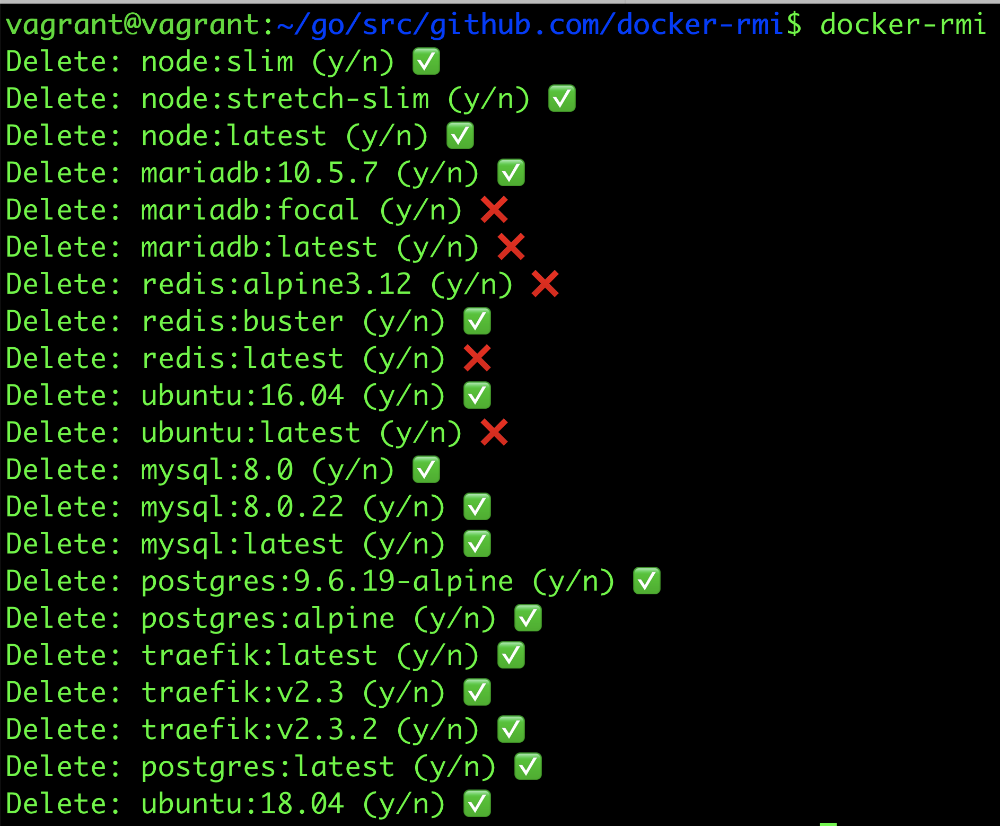

# docker-rmi

Have too many docker images on your local docker daemon, and not sure which ones to delete?

Remove docker images with a prompt: Press *y* to delete, and *n* to skip deletion.

## Key Features

- Delete docker images with confirmation. Press *y* to delete, and *n* to skip.
- Images (especially the big ones) gets deleted in the background, so you don't wait, you just move onto the next selection.

## Screencast

